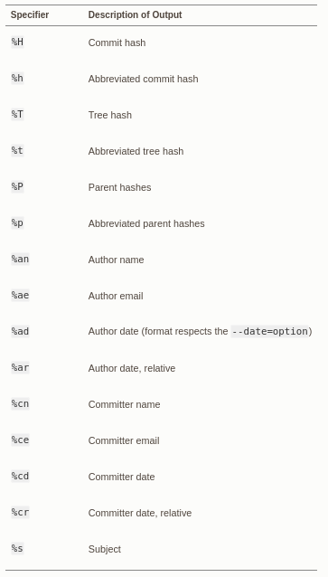
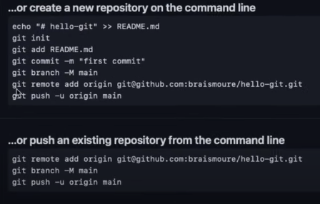

# GIT

***
Git is a distributed version control system.
***


## Installing on Linux

```shell 
sudo apt install git-all
```


### Check the Installing


```shell
git --version
```


## CONFIGURACTION

### The user name


```shell 
git config --global user.name "lady"
```

### the gmail name

```shell 
git config --global gmail.name "lady@gmail.com"
```


### Check configuration


```
git config --list
```


### Help in git


```shell
git add -h
```

## Getting a Git Repository

- You can take a local directory that is currently not under version control, and turn it into a Git repository, or

- You can clone an existing Git repository from elsewhere.


### Initialize a new repository


```bash
git init
```


## Tracking New Files

```shell
git branch -m main
git status
git add README
git commit -m "mesaje of the commit"

```


***
If you want to see what you’ve staged that will go into your next commit, you can use.
***

```
git diff --staged. 
```


## Viewing the Commit History


```
git log
```

### Specify the format explicitly,


```
git log --pretty=format:"%h - %an, %ar : %s"
```





# Connection with shh


[Link for the steps on Linux](https://docs.github.com/es/authentication/connecting-to-github-with-ssh)


### Lists the files in your .ssh directory, if they exist


```
ls -al ~/.ssh
```

## Create a directory .ssh file if not exist in the root


```
$ cd .ssh/
$ ssh-keygen -t ed25519 -C "lady@gmail.com"
    - Enter file in which to save the key: id_lady
    - Enter passphrase: lady123
```


```
eval "$(ssh-agent -s)"
```


```
ssh-add ~/.ssh/id_lady
```

# GITHUB


### Open de Github


```
- setting
- new ssh
    - add the Title
    - Open de file id_lady.epub
        - Copy the content
    - Paste in Key
        - Add shh
```


```
ssh -T git@github.com
    - yes
```

```
ssh -T git@github.com
    -- You've successfully authenticated
```





## Create a repository in github

***
You must run this command in the directory where your local project is located
***


```
git remote add origin git@github.com:user_name_github/repository_name
```


## Branch

### create branch

```
git branch branch-name
```

### change branch

```
git checkout branch-name
```


